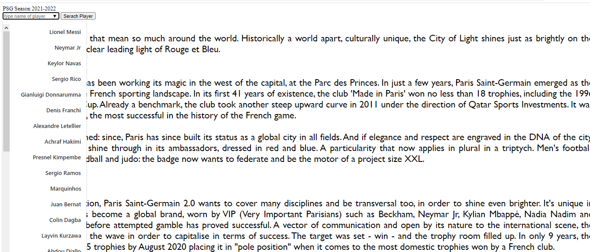
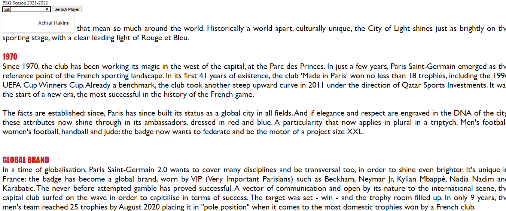
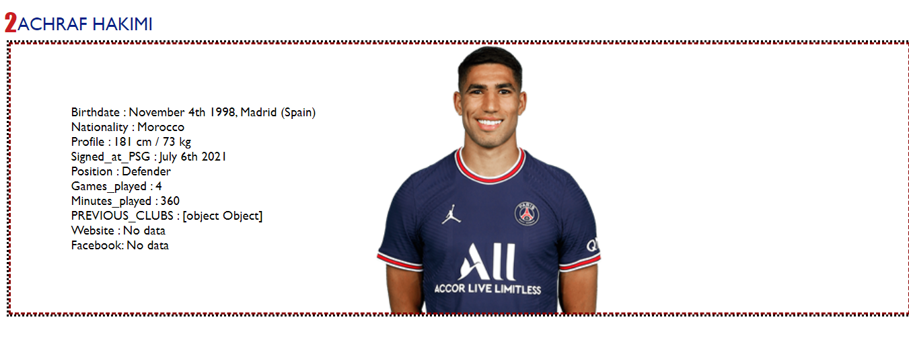
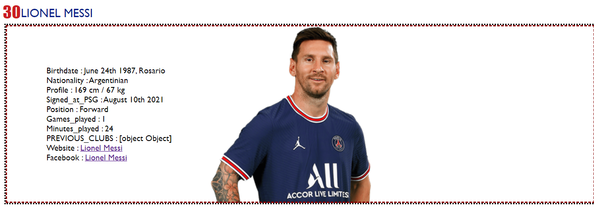

# Auto-Complete Search Engine  
**This is the WebAhead11 week 4 project by Aziz Abu Nahli & Omar Shammout - 2021©.**

*Project Idea* 

This app includes form for the user to search the details of the Paris Saint Germain team players ,
the user can type any letter and the search engine will complete the name for him (player's name), and display for him all the information about this player.

Main page (about the club):
:point_down:
---

---
Here it gives you also the full list of the players:
---

---
here's a sample for a search on the text "hak":
---

---
Player's details:
:point_down:
---

---
Here we can see the player's Facebook account link and player's website link (which can be accessed by clicking):
---

---
---
### Resources:
- [PSG's Website](https://en.psg.fr/).
- [Players Official Details](https://en.psg.fr/teams/first-team/squad).
---
## Important highlights: 
> - All the displayed details are up to date (31/08/2021).
> - There players with no shirt number,so it will display "Not Chosen Yet" in shirt number.
> - There Are players with no Facebook ACC and/or website link (according to PSG's website), so it will display "No Data". 
